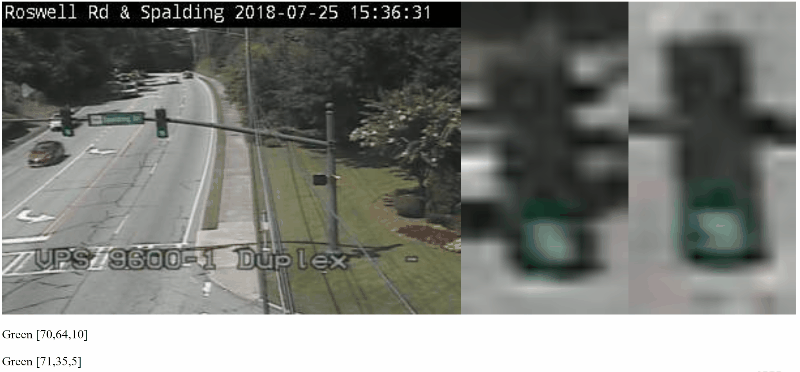

# Traffic CV
Toolset for determining physical state from traffic cameras.

[](https://travis-ci.org/ovsoinc/traffic-cv)
[](https://coveralls.io/github/ovsoinc/traffic-cv?branch=master)
[](https://github.com/Storj/ovsoinc/traffic-cv/blob/master/LICENSE)
[](https://github.com/ovsoinc/traffic-cv/graphs/contributors)
[](https://david-dm.org/ovsoinc/traffic-cv)
[](https://david-dm.org/ovsoinc/traffic-cv?type=dev)

### Demo


### Run Traffic Light Demo
```
node index.js
````
Then open up ```index.html``` in your browser.

### Train Traffic Light Neural Net
```
node train.js
```
You must have training images in `/images/training/green`, `/images/training/yellow`, and `/images/training/red`.

### Run the Trained Neural Net Through Test Suite
```
npm test
```
Will test the net against the training and testing data. Make sure to have categorized images in `/images/testing`.

### Test Neural Net with a Specific Image
```
node run.js [path_to_image]
```
Example:
```
node run.js images/38-1531834988419.jpeg
[ 0.01618855582872857, -0.00072788746163907, 0.46764020897403424 ]
Traffic lights are 'red' with a 46.76% probability.
```

### Capture Training/Testing Data
```
node index.js --capture
```
Will store captured images in `/images/capture` directory. You can then put those images in proper state directory in `/images/training` or `/images/testing` directory.
